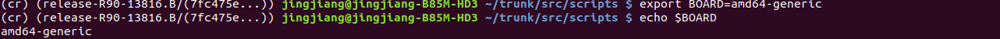

# Build Chromium OS


Chromium OS is an open-source project that aims to build an operating system that provides a fast, simple, and more secure computing experience for people who spend most of their time on the web. 

## 编译 Chromium OS 步骤

主要参考： 

https://chromium.googlesource.com/chromiumos/docs/+/HEAD/developer_guide.md


## 0、环境准备

1. 根据国内网络环境，准备好VPN （步骤，略）
2. 根据开发者指南，强烈建议仅使用 Ubuntu 18.04 版本进行后续操作
3. x86_64 64位操作系统

```

Ubuntu Linux (version 18.04 - Bionic)


Most developers working on Chromium OS are using Bionic (the LTS version of Ubuntu) and Debian testing (Buster). Things might work if you‘re running a different Linux distribution, but you will probably find life easier if you’re on one of these.
```

## 1、编译流程

### 命令行前缀标签说明

Commands are shown with different labels to indicate whether they apply to (1) your build computer (the computer on which you're doing development), (2) the chroot (Chrome OS SDK) on your build computer, or (3) your Chromium OS computer (the device on which you run the images you build):


| Label  | Commands | 
|-------|---------:|
| (outside) |    on your build computer, outside the chroot    | 
| (inside)  |   inside the chroot on your build computer    | 
| (in/out)   |   on your build computer, either inside or outside the chroot    |
| (device)   |   on your Chromium OS computer    |


### 开发环境准备

```
(outside)
sudo add-apt-repository universe
sudo apt-get install git gitk git-gui curl xz-utils \
     python3-pkg-resources python3-virtualenv python3-oauth2client

```


### Install depot_tools


参考：[https://commondatastorage.googleapis.com/chrome-infra-docs/flat/depot_tools/docs/html/depot_tools_tutorial.html#_setting_up](https://commondatastorage.googleapis.com/chrome-infra-docs/flat/depot_tools/docs/html/depot_tools_tutorial.html#_setting_up)


Clone the depot_tools repository:

```
$ git clone https://chromium.googlesource.com/chromium/tools/depot_tools.git

cd depot_tools & pwd

/home/jingjiang/depot_tools

```

将路径加入到 PATH 环境变量中：

```

vi ~/.bashrc

export PATH=/home/jingjiang/depot_tools:$PATH

:wq

source ~/.bashrc

```

### Tweak your sudoers configuration

参考: [https://chromium.googlesource.com/chromiumos/docs/+/HEAD/tips-and-tricks.md#How-to-make-sudo-a-little-more-permissive](https://chromium.googlesource.com/chromiumos/docs/+/HEAD/tips-and-tricks.md#How-to-make-sudo-a-little-more-permissive)

```
cd /tmp
cat > ./sudo_editor <<EOF#!/bin/sh
echo Defaults \!tty_tickets > \$1          # Entering your password in one shell affects all shells
echo Defaults timestamp_timeout=180 >> \$1 # Time between re-requesting your password, in minutes
EOF
chmod +x ./sudo_editor
sudo EDITOR=./sudo_editor visudo -f /etc/sudoers.d/relax_requirements

```

### Set locale


These may not be needed if you are building on a system that you already use, however if you have a clean instance on GCE, you'll need to set a better locale. For example, on Debian Buster on GCE, do:

```
(outside)
sudo apt-get install locales
sudo dpkg-reconfigure locales

```

When running dpkg-reconfigure locales, choose a language with UTF-8, e.g. en_US.UTF-8. For this change to take effect, you will need to log out and back in (closing all term windows, tmux/screen sessions, etc.).

### Configure git

Setup git now. If you don't do this, you may run into errors/issues later. Replace you@example.com and Your Name with your information:

```

(outside)
git config --global user.email "you@example.com"
git config --global user.name "Your Name"

```

### Double-check that you are running a 64-bit architecture

Run the following command:

```
(outside) uname -m

x86_64

```

### 获取源码 Get the source code

Chromium OS uses repo to sync down source code. repo is a wrapper for the git that helps deal with a large number of git repositories. You already installed repo when you installed depot_tools above.

```
(outside) mkdir -p ~/chromiumos
 (outside)
cd ~/chromiumos
repo init -u https://chromium.googlesource.com/chromiumos/manifest

```


### 选择需编译的特定分支 Branch Builds

参考: [https://chromium.googlesource.com/chromiumos/docs/+/HEAD/work_on_branch.md](https://chromium.googlesource.com/chromiumos/docs/+/HEAD/work_on_branch.md)

 you want to build on a branch, pass the branch name to repo init (e.g: repo init -u <URL> [-g minilayout] -b release-R80-12739.B).
When you use repo init you will be asked to confirm your name, email address, and whether you want color in your terminal. This command runs quickly. The repo sync command takes a lot longer.

```
cd ~/chromiumos/

repo init -b release-R90-13816.B

```


同步代码： 

```
cd ~/chromiumos
repo sync -j4

```


### Create a chroot & enter 

To make sure everyone uses the same exact environment and tools to build Chromium OS, all building is done inside a chroot. This chroot is its own little world: it contains its own compiler, its own tools (its own copy of bash, its own copy of sudo), etc. Now that you‘ve synced down the source code, you need to create this chroot. Assuming you’re already in ~/chromiumos (or wherever your source lives), the command to download and install the chroot is:

```
(outside) cros_sdk

```


Most of the commands that Chromium OS developers use on a day-to-day basis (including the commands to build a Chromium OS image) expect to be run from within the chroot. You can enter the chroot by calling:

```
(outside) cros_sdk

```

This is the same command used to create the chroot, but if the chroot already exists, it will just enter.


###  Select a board

```
(inside) export BOARD=amd64-generic
```


### Initialize the build for a board

To start building for a given board, issue the following command inside your chroot (you should be in the ~/trunk/src/scripts directory):

```
(inside) setup_board --board=${BOARD}
```


### Set the chronos user password


On a Chromium OS computer, you can get command line access (and root access through the sudo command) by logging in with the shared user account "chronos". You should set a password for the chronos user by entering the command below from inside the ~/trunk/src/scripts directory:

```
(inside) ./set_shared_user_password.sh
```

You will be prompted for a password, which will be stored in encrypted form in /etc/shared_user_passwd.txt.


### Optionally add Google API keys (Optionally)

参考： [https://www.chromium.org/developers/how-tos/api-keys](https://www.chromium.org/developers/how-tos/api-keys
)

 vi ~/.googleapikeys

```

google_api_key = "your_api_key"
google_default_client_id = "your_client_id"
google_default_client_secret = "your_client_secret"

```


### Build the packages for your board


To build all the packages for your board, run the following command from inside the ~/trunk/src/scripts directory:

```
(inside) ./build_packages --board=${BOARD}
```

The first time you run the build_packages command, it will take a long time (around 90 minutes on a four core machine), as it must build every package, and also download about 1.7GB of source packages and 1.3GB of binary packages. See here for more information about what the build_packages command actually does. In short, it tries to download existing binary packages to avoid building anything (and puts them in /build/${BOARD}/packages for subsequent builds). Failing that, it downloads source packages, puts them in /var/lib/portage/distfiles-target, and builds them.


### Build a disk image for your board

Once the build_packages step is finished, you can build a Chromium OS-base developer image by running the command below from inside the ~/trunk/src/scripts directory:

```
(inside) ./build_image --board=${BOARD} --noenable_rootfs_verification test
```


show the builds 

```
(inside) ls ~/trunk/src/build/images/${BOARD}

latest  R90-13816.52.2021_04_18_0751-a1

```

### Look at your disk image (optional)

```
(inside) ./mount_gpt_image.sh --board=${BOARD} --safe --most_recent
```

If you built a test image, also make sure to add -i chromiumos_test_image.bin to this command.

```
(inside) ./mount_gpt_image.sh --board=${BOARD} --safe --most_recent -i chromiumos_test_image.bin  

```


```

ls /tmp/m

```


Again, don‘t forget to unmount the root filesystem when you’re done:

```
(inside) ./mount_gpt_image.sh --board=${BOARD} -u
```


### 编译 kvm-qemu 使用的虚拟镜像 Building an image to run in a virtual machine

Many times it is easier to simply run Chromium OS in a virtual machine like kvm. You can adapt the previously built Chromium OS image so that it is usable by kvm (which uses qemu images) by entering this command from the ~/trunk/src/scripts directory:

```
(inside) ./image_to_vm.sh --board=${BOARD}

```

This command creates the file ~/trunk/src/build/images/${BOARD}/latest/chromiumos_qemu_image.bin.

If you built a test image, you also need to add the --test flag.

```

(inside) ./image_to_vm.sh --board=${BOARD} --test

```


### 加载镜像 lanuch on vm 


```
(inside) cros_vm --start --board amd64-generic --image-path /mnt/host/source/src/build/images/amd64-generic/R90-13816.52.2021_04_18_0751-a1/chromiumos_qemu_image.bin

```


* VNC server running on 127.0.0.1:5900

* SSH Port 9222 


### SSH 访问 SSH access to your test image (from host to vm)

```
(outside) ssh -p 9222 root@localhost 
password: test0000

localhost ~ # uname -a

```


### VNC 访问 

open Remmina 


All done !!! 

### 取消镜像加载 Stop vm 

```
cros_vm --stop

```


## 2、替换编译的内核 kernel replacement 

参考：

[https://www.chromium.org/chromium-os/how-tos-and-troubleshooting/using-an-upstream-kernel-on-snow](https://www.chromium.org/chromium-os/how-tos-and-troubleshooting/using-an-upstream-kernel-on-snow)

[https://chromium.googlesource.com/chromiumos/docs/+/master/kernel_development.md](https://chromium.googlesource.com/chromiumos/docs/+/master/kernel_development.md)


查看已有的内核：

```

(inside)  cd ~/trunk/src/third_party/kernel/
ls

upstream  v3.10  v3.14  v3.18  v3.8  v4.14  v4.14-gw  v4.19  v4.19-ht  v4.19-lakitu  v4.19-manatee  v4.4  v5.10  v5.4  v5.4-arcvm  v5.4-manatee


```


### Using cros_workon_make


Do an incremental build of the kernel:
```
(chroot) $ FEATURES="noclean" cros_workon_make --board=${BOARD} --install chromeos-kernel-[x_y]

```

To enable debug options like lockdep and KASAN, add USE="debug" to the command line above. This is highly recommended because the default build is optimized for performance rather than debugging purpose. Note that the debug build bloats the size of kernel image, and the image may not be able to fit into its partition on some older devices. The debug build also takes much longer to boot.

first:

```
(chroot) $ cros_workon --board=${BOARD} start chromeos-kernel-5_10

```


### Run cros_workon start

The first thing you need to do is to mark the package as active. Use the command below, replacing ${PACKAGE_NAME} with your package name (e.g., chromeos-wm):

```
(inside) cros_workon --board=${BOARD} start ${PACKAGE_NAME}

```
This command:
* Indicates that you'd like to build the 9999 version of the ebuild instead of the stable, committed version.
* Indicates that you'd like to build from source every time.
* If you specified that you wanted the minilayout when you did your repo init, this command adds a clause to your .repo/local_manifest.xml to tell repo to sync down the source code for this package next time you do a repo sync.

```
(chroot) $ cros_workon --board=${BOARD} start chromeos-kernel-5_10
```

```
(chroot) $ FEATURES="noclean" cros_workon_make --board=${BOARD} --install chromeos-kernel-5_10

```


### Detected file conllision(s)


just remove these files:

```
(cr) (release-R90-13816.B/(7fc475e...)) jingjiang@jingjiang-B85M-HD3 ~/trunk/src/scripts $ sudo rm -rf /build/amd64-generic/boot/vmlinuz
(cr) (release-R90-13816.B/(7fc475e...)) jingjiang@jingjiang-B85M-HD3 ~/trunk/src/scripts $ sudo rm -rf /build/amd64-generic/usr/lib/debug/boot/vmlinux 


```

```
(chroot) $ FEATURES="noclean" cros_workon_make --board=${BOARD} --install chromeos-kernel-5_10

```


**Clean up after you're done with your changes**

After you‘re done with your changes, you’re ready to clean up. The most important thing to do is to tell cros_workon that you're done by running the following command:

```
(inside) cros_workon --board=${BOARD} stop ${PACKAGE_NAME}

```

### 将设备上的内核更新 update kernel in the device 

```
 ~/trunk/src/scripts/update_kernel.sh --remote 127.0.0.1 --ssh_port 9222

```


**Test**:

```
ssh -p 9222 root@localhost 
password: test0000

uname -a 

```


## 3、Dev Server

参考：[https://chromium.googlesource.com/chromiumos/chromite/+/refs/heads/master/docs/devserver.md](https://chromium.googlesource.com/chromiumos/chromite/+/refs/heads/master/docs/devserver.md)

### Starting the Dev Server

Note: Before you start the dev server, you must have already run build_packages.sh. If you have not, please run this now.
The first step in using the dev server is starting the web server on your development machine:

```
(chroot)$ sudo start_devserver
```


local test:


chrome os vm test:


10.0.0.121 为加载虚拟镜像的主机IP。

### 4、Use Dev Server for Update

continue...


